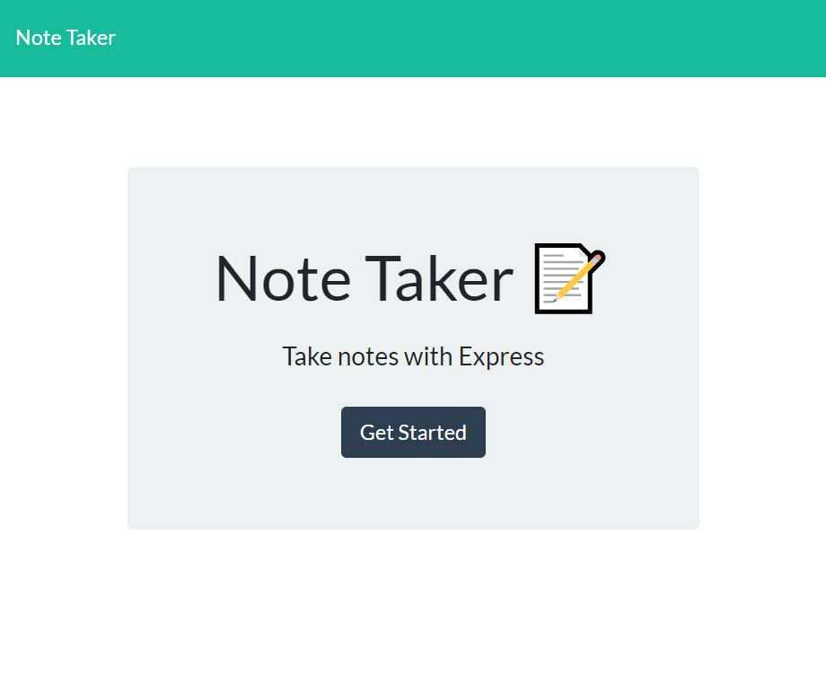

# HW11-NoteTaker

  ## Description

  [View deployed application](https://hw11-notetakeinator.herokuapp.com/notes)

this is a basic note taking application, it saves notes in a json file and runs on an express server to read and display saved notes, create new notes, and delete notes that are no longer needed. It uses different routes to update post and deles notes

    ## Table of Contents
  
  * [Description](#description)
  * [Installation](#installation)
  * [Usage](#usage)
  * [Tests](#tests)
  * [Future Features](#future)
  * [Contributing](#contributing)
  * [License](#license)
  * [Questions](#questions)
    
    ## Installation
  Run npm i

   ## Usage
  1. Navigate to url
  2. Push button to get started
  
  3. Enter a new note title and message
  4. Push the save button at the top
  5. Recall saved notes by clicking on the note tile in left column
  6. Push delete button next to any note you would like to delete
  
  
  
  ## Future
  Eventually i want to advance this app by making a user system and adding privacy as well, also storing in some cloud based database like dynamodb would be good
  
  ## License
  [MIT License](https://choosealicense.com/licenses/mit/)
  
  ## Contributing
  If you want to contribute to this repo:
  1. Fork the repo
  2. Improve
  3. Submit pull request to this repo
  
  
  ## Questions
  
  For more information:
  Visit my GitHub: [https://corbingar.github.io](https://corbingar.github.io)
    or you can reach me at my Email: corbingar@gmail.com